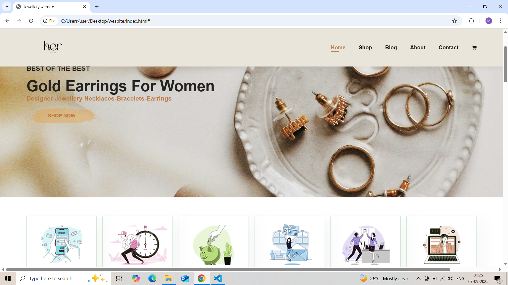
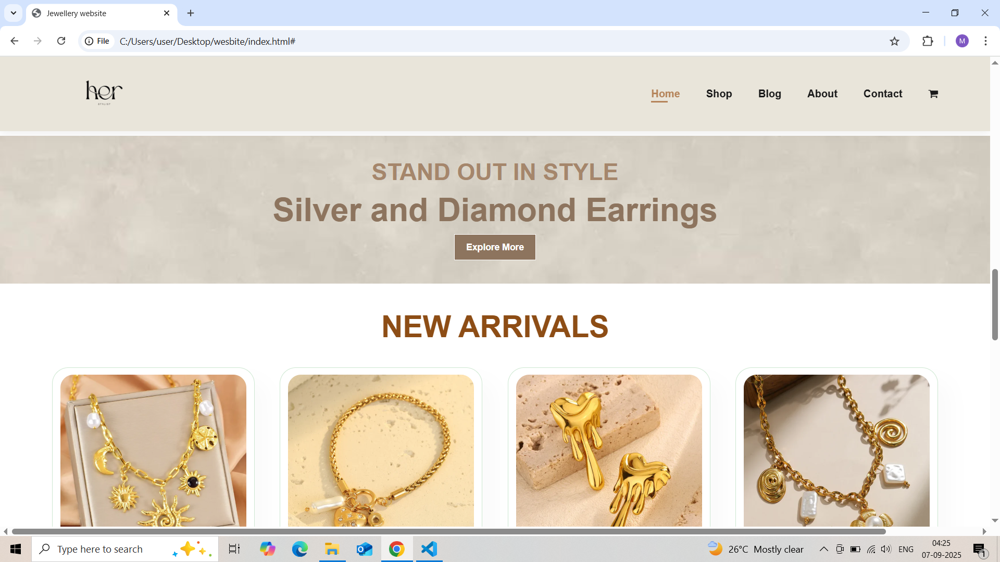
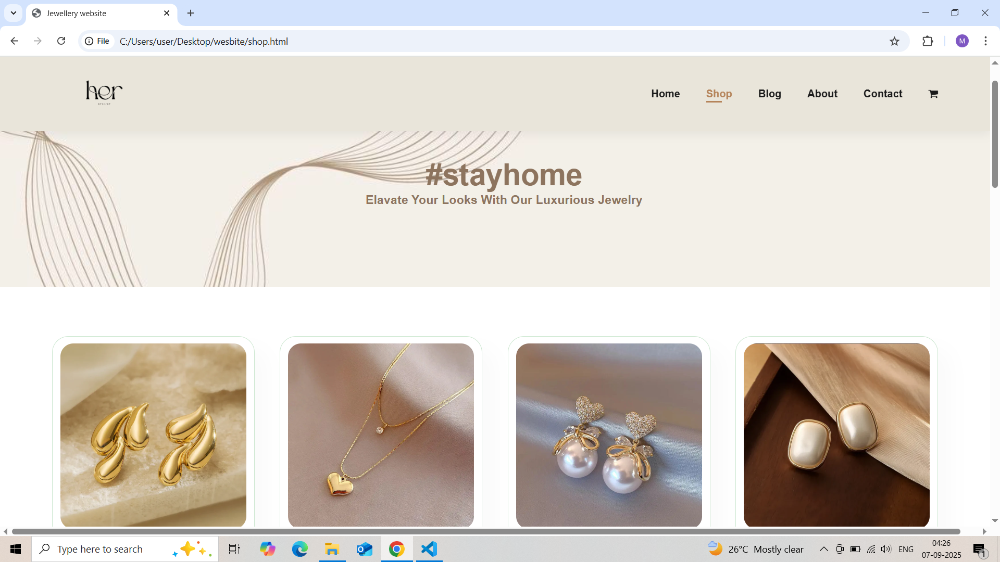
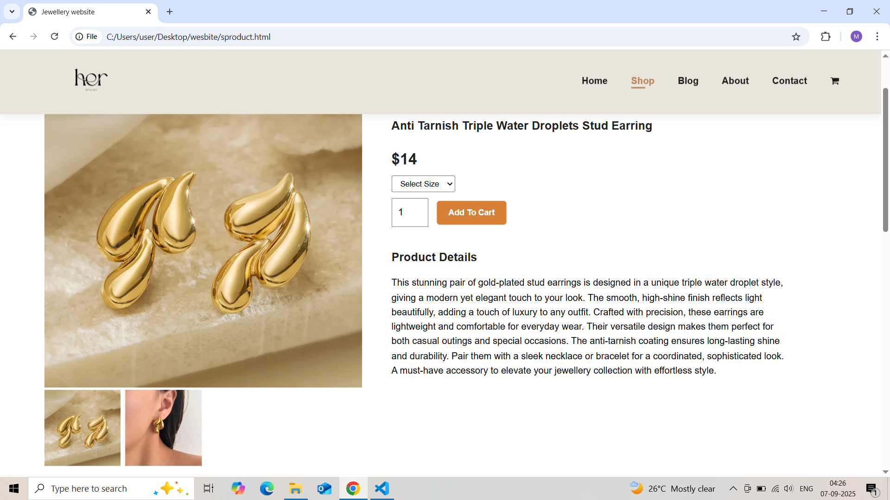
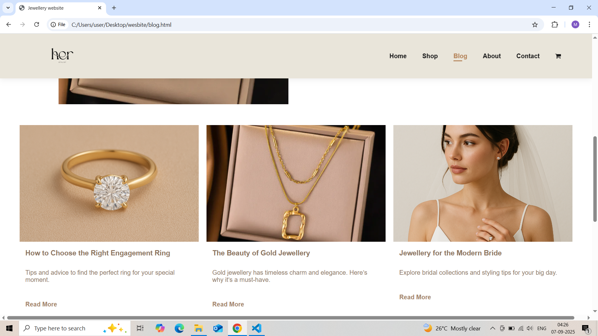
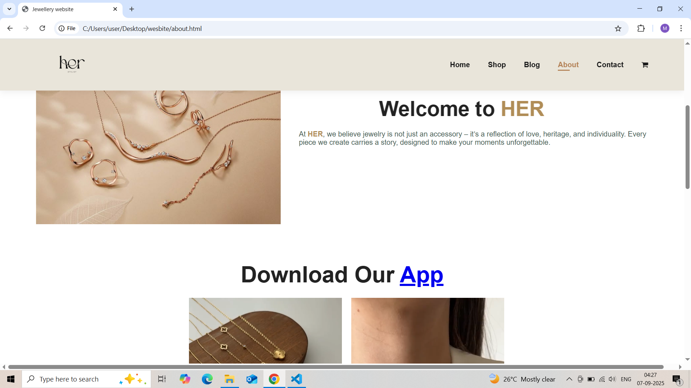
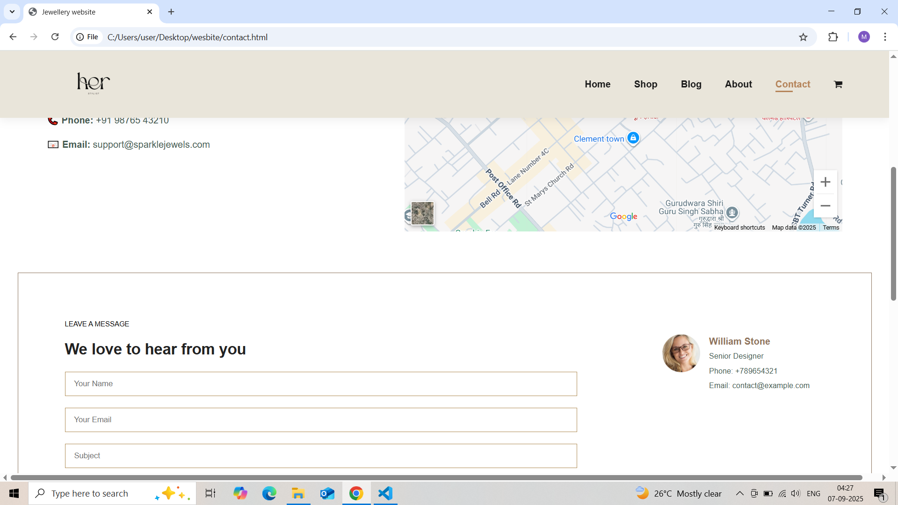
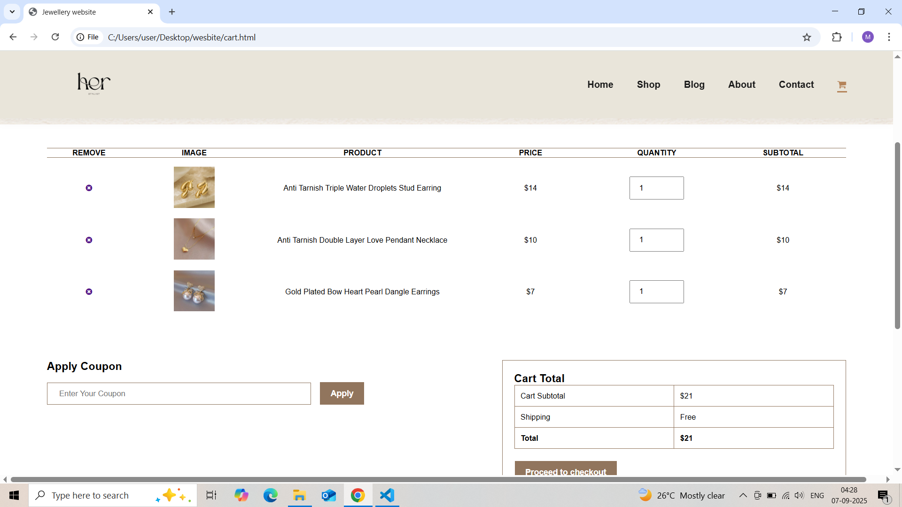

# 💎 Jewellery Website
A responsive **jewellery website** built with **HTML, CSS, and JavaScript**.  
This project showcases elegant jewellery collections with a modern and stylish design.  

---

## 🌟 Features
- Fully responsive design (desktop, tablet, and mobile friendly)  
- Home, About, Shop, Blog, and Contact pages  
- Jewellery collection showcase (rings, bracelets, necklaces, bridal sets, etc.)  
- Hero banner images and promotional sections  
- Contact form for customer inquiries  

---

## 🛠️ Technologies Used
- **HTML5** – Website structure  
- **CSS3** – Styling & animations  
- **JavaScript (ES6)** – Interactivity  
- **GitHub Pages** – Hosting  

---

## 📂 Project Structure
```
JewelleryWebsite/
│── index.html
│── about.html
│── shop.html
│── blog.html
│── contact.html
│── css/
│   └── style.css
│── js/
│   └── script.js
│── images/
│   └── (all jewellery images)
└── README.md
```

---

## 🚀 Getting Started

1. Clone this repository:
   ```bash
   git clone https://github.com/Muskaan-Choudhary/jewellery-website.git
   ```
2. Navigate to the project folder:
   ```bash
   cd jewellery-website
   ```
3. Open `index.html` in your browser to view the site.

---


## 📸 Screenshots
_Homepage Preview:_  


_Shop Preview:_  


_Product Page Preview:_  


_Blog Preview:_  


_About Preview:_  


_Contact Preview:_  


_Cart Preview:_  


---

## 👩‍💻 Author
**Muskaan Choudhary**  
Front-End Developer | Web Designer  

---

## 🤝 Contributing
Pull requests are welcome. For major changes, please open an issue first to discuss what you would like to change.  

---


